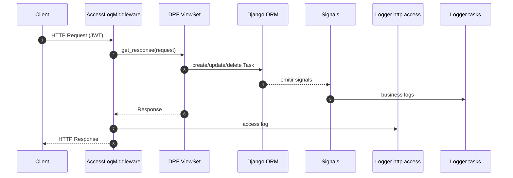
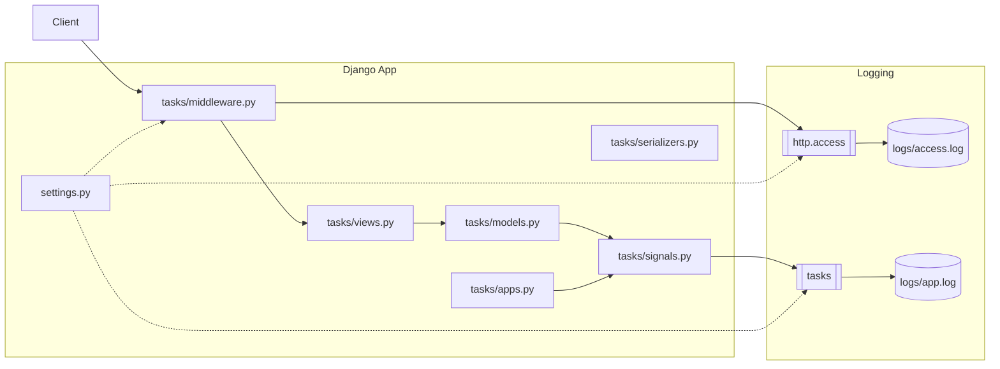

# 📝 Invera ToDo-List Challenge

API REST en **Django + DRF** para gestionar una lista de tareas con autenticación JWT, filtros, logs, tests y despliegue con Docker.

## 📌 Funcionalidades
- Registro y autenticación de usuarios vía **JWT**.
- CRUD de tareas:
  - Crear, listar, actualizar y eliminar.
  - Marcar como completadas.
- Filtros:
  - Por contenido (`?search=...`)
  - Por fecha de creación (`?created_after=YYYY-MM-DD`)
- **Logs**:
  - Access logs vía middleware (método, path, status, usuario, duración).
  - Business logs vía signals (creación, actualización, completado, borrado).
- **Tests** de integración (DRF APIClient).
- Despliegue en **Docker** con Gunicorn y SQLite persistente.

---

## Instalación y ejecución

### Local (sin Docker)
```bash
# Crear entorno y activar
python -m venv venv
source venv/bin/activate   # Windows: venv\Scripts\activate

# Instalar dependencias
pip install -r requirements.txt

# Migraciones y superusuario
python manage.py migrate
python manage.py createsuperuser

# Levantar servidor
python manage.py runserver
```

---

### Con Docker
Requiere Docker y Docker Compose.

1. Crear archivo `.env`:
```env
SECRET_KEY=changeme-super-secret
DEBUG=0
ALLOWED_HOSTS=*
ACCESS_TOKEN_DAYS=7
REFRESH_TOKEN_DAYS=30
```

2. Construir y levantar:
```bash
docker compose up --build
```

3. Crear superusuario (opcional):
```bash
docker compose run --rm web python manage.py createsuperuser
```

---

## Endpoints principales

### Autenticación
- `POST /api/register/` → Registro de usuario
- `POST /api/login/` → Obtener `access` y `refresh` tokens
- `POST /api/refresh/` → Renovar token `access`

### Tareas
- `GET /api/tasks/` → Listar tareas propias
  - Filtros: `?search=...` y/o `?created_after=YYYY-MM-DD`
- `POST /api/tasks/` → Crear tarea
- `GET /api/tasks/{id}/` → Detalle de tarea
- `PUT /api/tasks/{id}/` → Actualizar tarea
- `DELETE /api/tasks/{id}/` → Eliminar tarea
- `PUT /api/tasks/{id}/complete/` → Marcar como completada

---

## Ejemplos con `curl`

### Registro
```bash
curl -X POST http://localhost:8000/api/register/  -H "Content-Type: application/json"  -d '{"username":"lucas","email":"lucas@mail.com","password":"12345678"}'
```

### Login
```bash
curl -X POST http://localhost:8000/api/login/  -H "Content-Type: application/json"  -d '{"username":"lucas","password":"12345678"}'
```

### Crear tarea
```bash
curl -X POST http://localhost:8000/api/tasks/  -H "Authorization: Bearer <ACCESS_TOKEN>"  -H "Content-Type: application/json"  -d '{"title":"Estudiar Django","description":"Challenge Invera"}'
```

### Marcar como completada
```bash
curl -X PUT http://localhost:8000/api/tasks/1/complete/  -H "Authorization: Bearer <ACCESS_TOKEN>"
```

### Filtrar
```bash
# Por texto
curl -X GET "http://localhost:8000/api/tasks/?search=estudiar"  -H "Authorization: Bearer <ACCESS_TOKEN>"

# Por fecha
curl -X GET "http://localhost:8000/api/tasks/?created_after=2025-08-01"  -H "Authorization: Bearer <ACCESS_TOKEN>"
```

---

## Logs

- **Access logs**: `logs/access.log`  
  Middleware `AccessLogMiddleware` registra método, path, status, usuario y duración.

- **Business logs**: `logs/app.log`  
  Signals (`tasks/signals.py`) registran:
  - `task created`
  - `task updated`
  - `task completed`
  - `task uncompleted`
  - `task deleted`

**Ejemplo access log**
```
ts=2025-08-06T12:34:57-0300 level=INFO logger=http.access method=POST path=/api/tasks/ status=201 user=lucas duration_ms=32 msg=request completed
```

**Ejemplo business log**
```
12:35:10 [INFO] tasks: task completed by lucas
```

---

## Tests

Para correr los tests:
```bash
# Local
python manage.py test -v 2

# Docker
docker compose run --rm web python manage.py test -v 2
```

Los tests (`tasks/test.py`) cubren:
- Registro y login
- Auth obligatoria
- Crear tarea
- Listar (solo propias)
- Filtros por texto y fecha
- Update
- Acción complete
- Delete
- Aislamiento de usuarios

---

## Diagramas

### Secuencia: Request → Middleware → ViewSet/DRF → Signals → Loggers


### Componentes


---

## Estructura del proyecto
```
todo_challenge/
├── todo_challenge/       # Configuración del proyecto
├── tasks/                # App de tareas
│   ├── migrations/
│   ├── models.py
│   ├── views.py
│   ├── serializers.py
│   ├── urls.py
│   ├── middleware.py
│   ├── signals.py
│   └── test.py
├── logs/                 # Logs persistentes
├── db/                   # Base SQLite persistente (Docker)
├── Dockerfile
├── docker-compose.yml
├── requirements.txt
└── README.md
```

---

## Notas finales
- **JWT** configurable vía `.env` (`ACCESS_TOKEN_DAYS`, `REFRESH_TOKEN_DAYS`).
- **SQLite** para simplicidad, pero fácilmente migrable a PostgreSQL/MySQL.
- **Logs** preparados para ser enviados a Loki/Grafana si se requiere.
- **Tests** listos para CI/CD (puede agregarse GitHub Actions fácilmente).

# Invera ToDo-List Challenge (Python/Django Jr-SSr)

El propósito de esta prueba es conocer tu capacidad para crear una pequeña aplicación funcional en un límite de tiempo. A continuación, encontrarás las funciones, los requisitos y los puntos clave que debés tener en cuenta durante el desarrollo.

## Qué queremos que hagas:

- El Challenge consiste en crear una aplicación web sencilla que permita a los usuarios crear y mantener una lista de tareas.
- La entrega del resultado será en un nuevo fork de este repo y deberás hacer una pequeña demo del funcionamiento y desarrollo del proyecto ante un super comité de las más grandes mentes maestras de Invera, o a un par de devs, lo que sea más fácil de conseguir.
- Podes contactarnos en caso que tengas alguna consulta.

## Objetivos:

El usuario de la aplicación tiene que ser capaz de:

- Autenticarse
- Crear una tarea
- Eliminar una tarea
- Marcar tareas como completadas
- Poder ver una lista de todas las tareas existentes
- Filtrar/buscar tareas por fecha de creación y/o por el contenido de la misma

## Qué evaluamos:

- Desarrollo utilizando Python, Django. No es necesario crear un Front-End, pero sí es necesario tener una API que permita cumplir con los objetivos de arriba.
- Uso de librerías y paquetes estandares que reduzcan la cantidad de código propio añadido.
- Calidad y arquitectura de código. Facilidad de lectura y mantenimiento del código. Estándares seguidos.
- [Bonus] Manejo de logs.
- [Bonus] Creación de tests (unitarias y de integración)
- [Bonus] Unificar la solución propuesta en una imagen de Docker por repositorio para poder ser ejecutada en cualquier ambiente (si aplica para full stack).

## Requerimientos de entrega:

- Hacer un fork del proyecto y pushearlo en github. Puede ser privado.
- La solución debe correr correctamente.
- El Readme debe contener todas las instrucciones para poder levantar la aplicación, en caso de ser necesario, y explicar cómo se usa.
- Disponibilidad para realizar una pequeña demo del proyecto al finalizar el challenge.
- Tiempo para la entrega: Aproximadamente 7 días.
